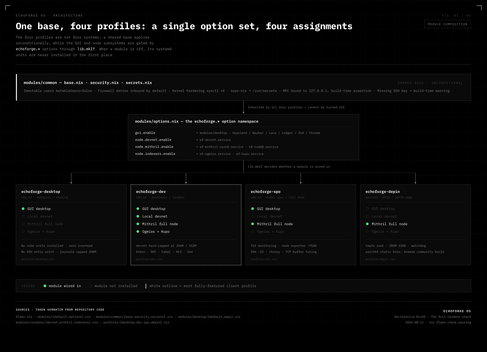
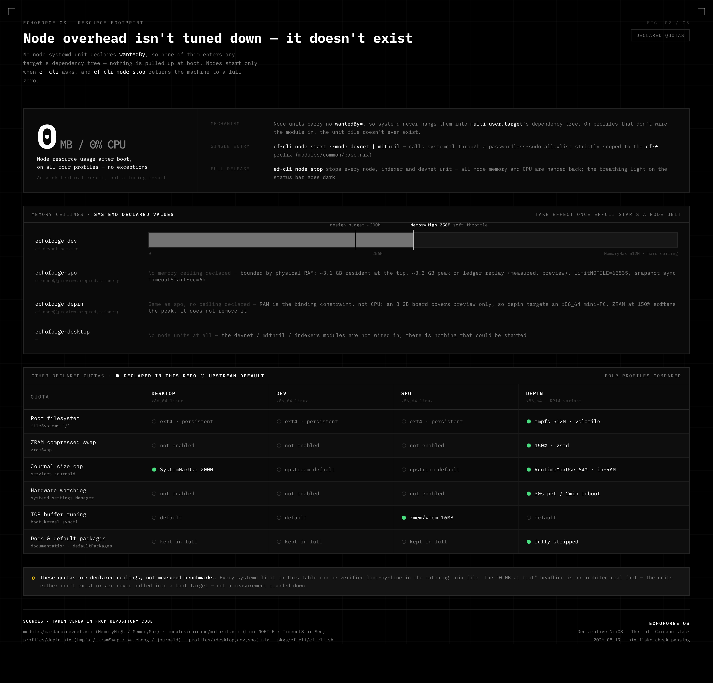
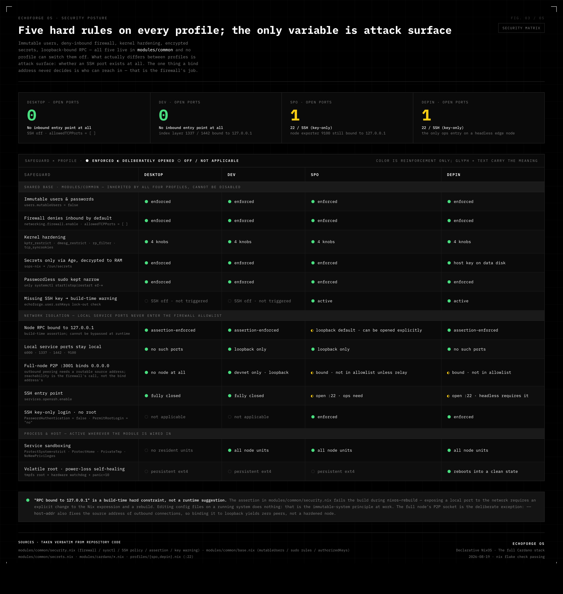
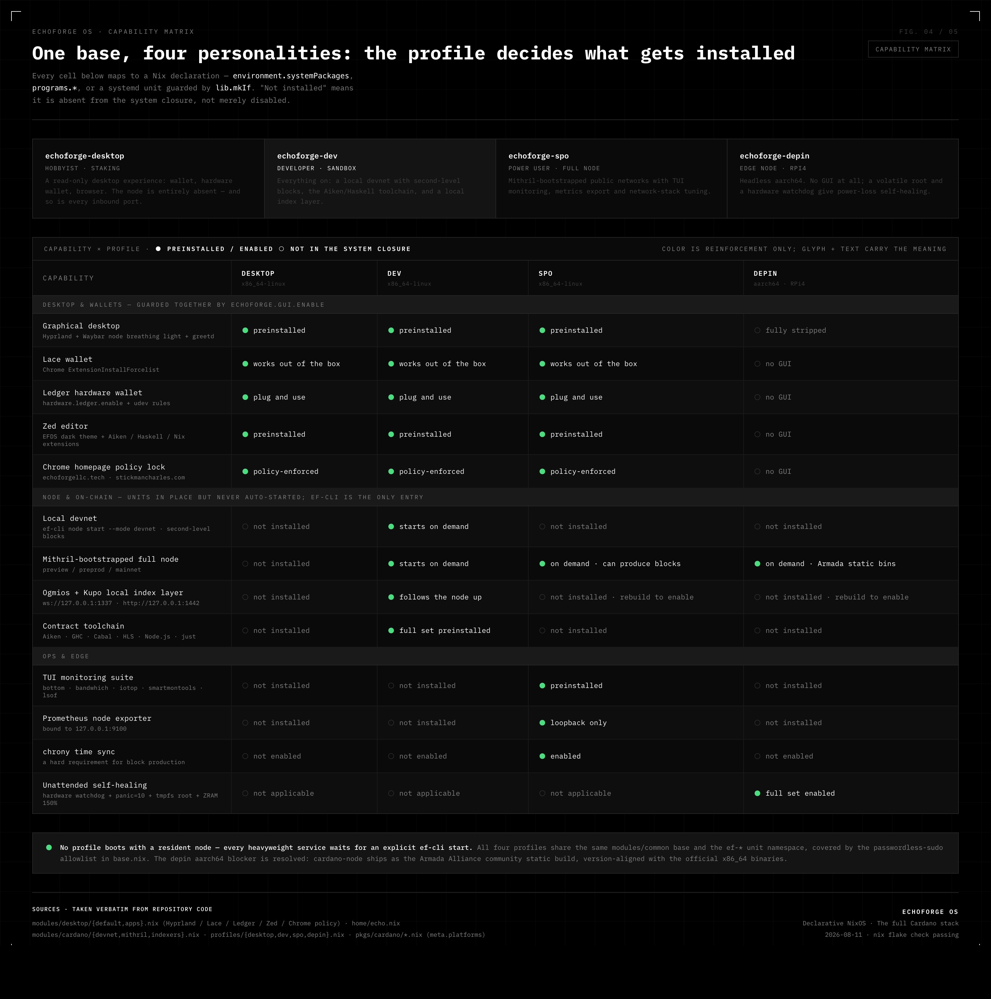
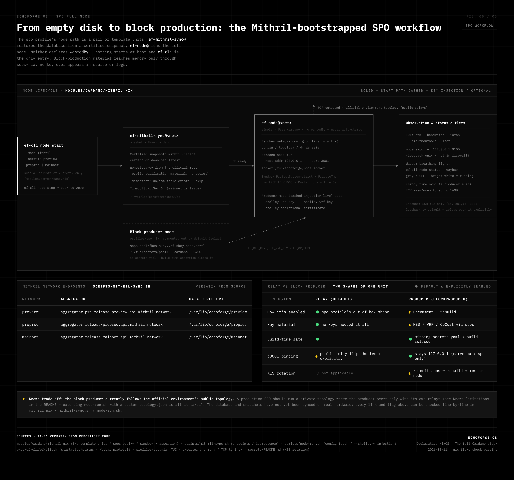

<div align="center">

<picture>
  <source media="(prefers-color-scheme: dark)" srcset="docs/brand/echoforge-lockup-white.png">
  
</picture>

<br>

**A declarative NixOS distribution for the full Cardano stack — one base, four profiles.**


</div>

---

EchoForge OS (EFOS) is a NixOS-based operating system for everyone who touches Cardano —
stakers, dApp developers, stake-pool operators and DePIN fleet runners. Instead of four
separate distros, it ships **one shared, hardened base** and four build targets that differ
only in which modules get wired in. Everything is a flake output: rebuild it anywhere,
bit-for-bit, from this repository.



## The four profiles

| Profile | Audience | Form | In one line |
|---|---|---|---|
| `echoforge-desktop` | Hobbyist · staking & browsing | GUI light desktop | Read-only desktop with Lace + Ledger; the node is entirely absent — zero overhead |
| `echoforge-dev` | Smart-contract developer | GUI/CLI sandbox | On-demand local devnet (~200 MB, second-level blocks) + Aiken / GHC / Ogmios / Kupo + Zed |
| `echoforge-spo` | Power user · protocol & full node | GUI/TUI hybrid | Mithril snapshot sync for preview / preprod / mainnet, TUI monitoring, optional block producer |
| `echoforge-depin` | DePIN edge node | Headless · RPi4 | aarch64, tmpfs root, ZRAM, hardware watchdog — survives power loss unattended |

## Quick start

```bash
git clone https://github.com/EchoForge-Dev/EchoForge-OS.git
cd EchoForge-OS

# 1. Build any profile closure (on NixOS or a Linux builder)
nix build .#nixosConfigurations.echoforge-dev.config.system.build.toplevel

# 2. Activate it on the target machine
sudo nixos-rebuild switch --flake .#echoforge-dev

# 3. depin: flashable RPi4 SD image (.img.zst — root partition auto-expands on first boot)
nix build .#packages.aarch64-linux.depin-sd-image
```

> **Disk conventions** — partition by label at install time, no code changes needed:
> `echoforge-root` (ext4) + `EFOS-BOOT` (vfat) for the desktop-class profiles;
> the depin SSD deployment (`echoforge-depin`) expects `echoforge-nix`, `echoforge-data`,
> optional `echoforge-swap` and `FIRMWARE`; the SD-image form (`echoforge-depin-sd`)
> needs no manual partitioning at all.

To bump an upstream binary, edit the `version` in `pkgs/cardano/*.nix` and run
`./scripts/prefetch-hashes.sh` to re-verify and fill in the SRI hashes.

## `ef-cli` — the dynamic node engine

The system **never** boots a heavyweight node. No node unit declares `wantedBy`, so nothing
enters the boot dependency tree — `ef-cli` is the only way up, and `stop` is a full release:

```bash
ef-cli node start --mode devnet                      # local private chain (~200 MB, second-level blocks)
ef-cli node start --mode mithril --network preview   # Mithril snapshot → preview/preprod/mainnet
ef-cli node stop                                     # release all node memory & CPU
ef-cli node status [--waybar]                        # status query / status-bar JSON
ef-cli pool status [--network N] [--json]            # producer / KES-period status
ef-cli pool rotate-kes [--network N]                 # new KES pair + offline re-signing steps
ef-cli profile switch <desktop|dev|spo|depin>        # nixos-rebuild into another profile
```

The monochrome breathing light on the Waybar tracks it live: gray = OFF, bright white = running.
One socket for everything: `/run/echoforge/node.socket`; Ogmios at `127.0.0.1:1337`, Kupo at `127.0.0.1:1442`.



## Security model

- **Immutable system** — `users.mutableUsers = false`; every change goes through
  `flake.nix` + `nixos-rebuild`. No runtime `apt`/`pacman`, no hand-editing `/etc`.
- **Zero secret leakage** — sensitive material exists only as sops-nix Age ciphertext,
  decrypted to the in-memory mount `/run/secrets/` (see [secrets/README.md](secrets/README.md)).
- **Network isolation** — node / Ogmios / Kupo bind to `127.0.0.1` and a **build-time
  assertion** guards it; the firewall denies all inbound by default, with SSH (key-only)
  opened solely on `spo` / `depin`.



## Preinstalled on the desktop profiles (desktop / dev / spo)

| App | Integration |
|---|---|
| **Lace Wallet** | Forced install via Chrome enterprise policy `ExtensionInstallForcelist` — works out of the box |
| **Ledger** | `hardware.ledger.enable = true` + udev rules — plug and use |
| **Zed Editor** | Preinstalled with the EFDS dark high-contrast theme + Aiken / Haskell / Nix extensions |
| **Google Chrome** | Homepage & new-tab policy locked to echoforgellc.tech / stickmancharles.com |



## SPO block production

Out of the box the `spo` profile is a loopback-only observer: official public topology, no
inbound port. Two commented role blocks in `profiles/spo.nix` turn it into a real pool —
pick exactly one per machine.

**Relay** — reachable, public port open, `localRoots` pointing at your own producer and
sibling relays:

```nix
hostAddr = "0.0.0.0";
mithril.openFirewall = true;
mithril.topology.localRoots = [ { address = "10.0.0.10"; port = 3001; } ];
mithril.topology.bootstrapPeers = [ { address = "backbone.cardano.iog.io"; port = 3001; } ];
```

**Block producer** — keeps its loopback/private address and stays out of `allowedTCPPorts`;
`localRoots` lists only your own relays, and the generated topology pins
`useLedgerAfterSlot = -1` with `bootstrapPeers = null`, so the producer never touches public
peer discovery:

```nix
mithril.blockProducer.enable = true;
mithril.topology.localRoots = [ { address = "relay-1.example.com"; port = 3001; } ];
```

With `blockProducer.enable`, the `ef-node@` unit appends `--shelley-kes-key` /
`--shelley-vrf-key` / `--shelley-operational-certificate`, sourced from sops
(`secrets/secrets.yaml` → `/run/secrets/pool/`). Missing secrets fail the build — you cannot
ship a producer without its keys. Build-time guards also catch `openFirewall` with a loopback
`hostAddr` (assertion), and warn when a producer runs public topology, opens its port, or sets
bootstrap peers.

Day-to-day operation runs through `ef-cli pool`. `cardano-cli` is on `PATH` on any
node-enabled profile, with `CARDANO_NODE_SOCKET_PATH` pre-pointed at
`/run/echoforge/node.socket` (the operator account is in the `cardano` group; the socket is
`0770`, the KES/VRF keys stay `0400` and out of reach):

```bash
ef-cli pool status          # KES period, certificate validity window, on-chain vs local counter
ef-cli pool rotate-kes      # new KES pair in tmpfs + the exact offline issue-op-cert command
```

`rotate-kes` generates the KES pair into `$XDG_RUNTIME_DIR` (memory-backed, never on disk) and
computes the current KES period from chain tip and Shelley genesis. It stops there by design:
the cold key lives on your offline signer, so re-issuing the operational certificate and
folding both artifacts back into sops stay manual steps.

**Not covered:** on-chain pool onboarding — cold/stake key generation, pool registration and
delegation certificates, metadata hosting, and the 500 ADA deposit transaction — is plain
`cardano-cli` work against the running node.



## Repository layout

```
flake.nix                  # four profile build targets + package outputs
├── profiles/              # desktop / dev / spo / depin (+ depin disk layouts)
├── modules/
│   ├── options.nix        # the echoforge.* option namespace
│   ├── common/            # immutable base · security policy · sops-nix secrets
│   ├── cardano/           # dynamic node engine (devnet / mithril / ogmios+kupo units)
│   └── desktop/           # Hyprland + Waybar GUI, Lace / Ledger / Zed / Chrome integration
├── home/                  # EFDS visual layer (Waybar breathing light, Zed theme)
├── pkgs/                  # ef-cli + static Cardano binary packaging
├── scripts/               # node runners + hash-prefetch tooling
├── secrets/               # sops-nix Age templates (decrypt to /run/secrets)
└── docs/                  # engineering figures + brand assets
```

## Known limitations

1. **aarch64 node trust chain** — the `cardano-node-bin` aarch64 static binaries come from the
   community [Armada Alliance](https://github.com/armada-alliance/cardano-node-binaries) builds
   (musl static, version-aligned with the official x86_64 10.1.4 binaries). If you require
   same-origin builds, compile from source via haskell.nix and override `cardano-node-bin`
   in the overlay.
2. **Real-hardware validation** — the `echoforge-depin-sd` image (sd-image-aarch64 +
   nixos-hardware RPi4) has not yet been flashed and verified on a physical RPi4.
3. **Producer topology** — the block producer currently follows the public topology. A
   production SPO should run a private "producer peers only with its own relays" topology
   (extending `node-run.sh` with a custom `topology.json` is all it takes).

## License

Code is licensed under [Apache-2.0](LICENSE.md). The EchoForge name, wordmarks and logo
assets under `docs/brand/` are **not** open source — see [LICENSE-NOTICE.md](LICENSE-NOTICE.md).

<div align="center">
<sub>Design language: EchoForge Design System — pure black / white / gray, four status colors, IBM Plex Mono.</sub>
</div>
